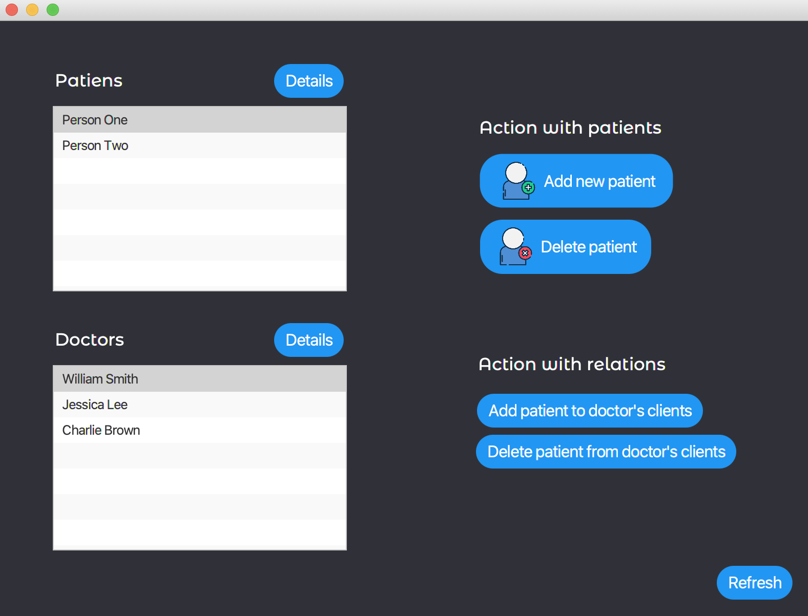

# Hospital-Database-Application
Semestral project B0B36DBS - Databázové systémy (Database Systems)

A simple GUI desktop application in Java with JPA access to the database of hospital.

This application allows the user (more specifically, the medical staff) to add and remove patients from the database, change their data if necessary, and keep information about the actual treating doctors for each patient.

